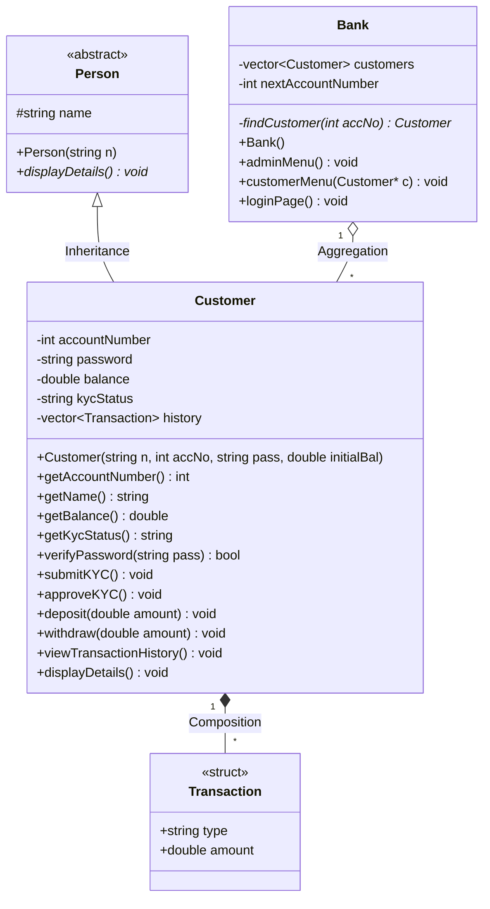
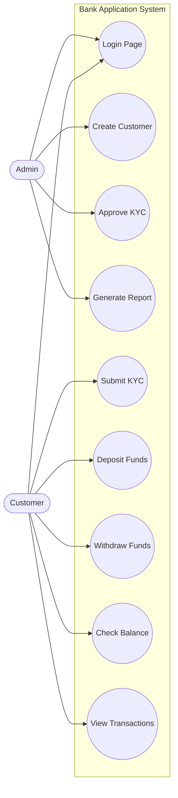
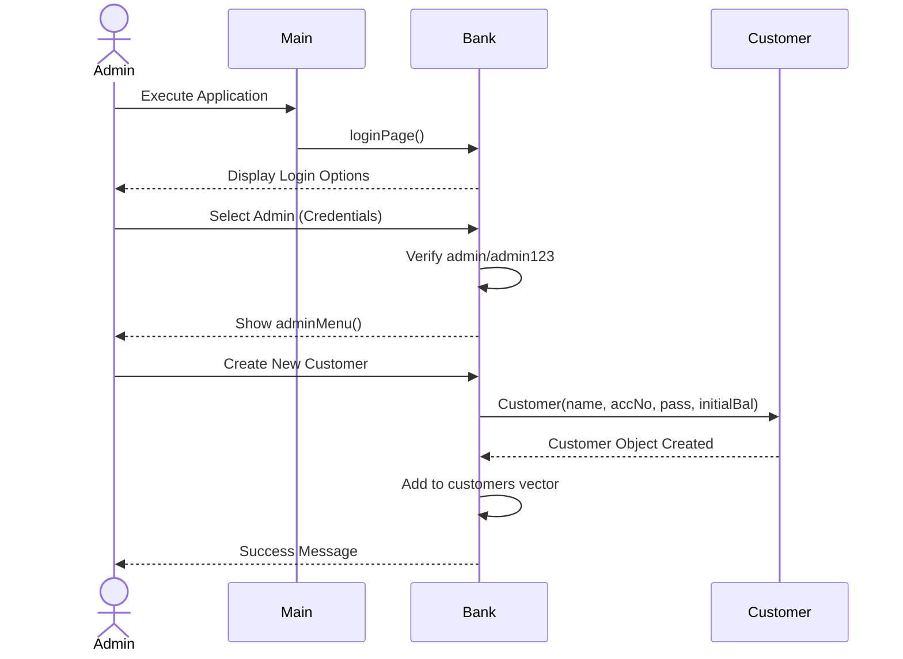

# Bank Application Project Report

## 1. Front Page
**Course Name:** Application Design (OOP Principles)
**Project Title:** Digital Bank Application in C++
**Submitted By:** Anne Joshla
**Date:** April 2026

---

## 2. Introduction
### 2.1 Project Objective
The objective of this project is to design and implement a robust, secure, and interactive Console-based Banking Application using C++. This application aims to simulate the real-world functionalities of a digital banking system, offering two primary modes of operation: an Admin Panel and a Customer Portal. 

### 2.2 Features
- **Admin Module:**
  - Secure authentication.
  - Creation of new customer accounts with an initial deposit.
  - Review and approval of Know Your Customer (KYC) submissions.
  - Generation of a master report detailing all customer accounts, balances, and KYC statuses.
- **Customer Module:**
  - Secure login using Account Number and Password.
  - Submission of KYC details for admin review.
  - Financial transactions including Deposits and Withdrawals.
  - Balance checking mechanism.
  - Detailed, persistent transaction history for each user.

### 2.3 Object-Oriented Programming (OOP) Principles Applied
This project heavily relies on core OOP principles to ensure the codebase is modular, reusable, and maintainable.
1. **Encapsulation:** 
   - Sensitive customer data such as `accountNumber`, `password`, `balance`, and `transaction history` are marked as `private` within the `Customer` class. These variables can only be accessed or modified through public member functions like `deposit()`, `withdraw()`, and `getBalance()`.
2. **Inheritance:**
   - A base class `Person` is created to hold common attributes like `name`. The `Customer` class inherits from `Person` (`class Customer : public Person`), demonstrating an "is-a" relationship and promoting code reusability.
3. **Abstraction:**
   - The application hides complex implementation details from the user. For example, when a user selects "Deposit Funds", they simply input an amount. The internal mechanisms of updating balances and recording the transaction in the history vector are abstracted away. Furthermore, `Person` contains a pure virtual function `virtual void displayDetails() = 0;`, making it an abstract class.
4. **Polymorphism:**
   - The `displayDetails()` function is overridden in the `Customer` class (`void displayDetails() override;`). This allows for dynamic dispatch if pointers to the base class `Person` were used, demonstrating runtime polymorphism.

---

## 3. UML Diagrams

### 3.1 Class Diagram
The Class Diagram illustrates the static structure of the banking application, including classes, attributes, methods, and the relationships between them (Inheritance, Composition, and Aggregation).



### 3.2 Use Case Diagram
The Use Case Diagram defines the interactions between the external actors (Admin and Customer) and the system functionalities.



### 3.3 Sequence Diagram
The Sequence Diagram visualizes the time-based flow of messages during a standard user interaction, such as creating an account and performing a transaction.



---

## 4. Coding

The implementation is modularized into header (`.h`) files for declarations and C++ (`.cpp`) files for logic.

### 4.1 Models.h
Defines the core data structures and the base abstract class.
```cpp
#ifndef MODELS_H
#define MODELS_H

#include <string>
#include <vector>

struct Transaction {
    std::string type;
    double amount;
};

class Person {
protected:
    std::string name;
public:
    Person(std::string n) : name(n) {}
    virtual void displayDetails() = 0; 
    virtual ~Person() {} 
};

#endif
```

### 4.2 Customer.h
Header file for the Customer class, inheriting from Person.
```cpp
#ifndef CUSTOMER_H
#define CUSTOMER_H

#include "Models.h"

class Customer : public Person {
private:
    int accountNumber;
    std::string password;
    double balance;
    std::string kycStatus;
    std::vector<Transaction> history;

public:
    Customer(std::string n, int accNo, std::string pass, double initialBal);
    int getAccountNumber();
    std::string getName();
    double getBalance();
    std::string getKycStatus();
    bool verifyPassword(std::string pass);
    void submitKYC();
    void approveKYC();
    void deposit(double amount);
    void withdraw(double amount);
    void viewTransactionHistory();
    void displayDetails() override;
};

#endif
```

### 4.3 Customer.cpp
Implementation of Customer behaviors and transactions.
```cpp
#include "Customer.h"
#include <iostream>
#include <iomanip>

using namespace std;

// Constructor
Customer::Customer(string n, int accNo, string pass, double initialBal) 
    : Person(n), accountNumber(accNo), password(pass), balance(initialBal), kycStatus("Not Submitted") {
    if (initialBal > 0) {
        history.push_back({"Initial Deposit", initialBal});
    }
}

// Getters
int Customer::getAccountNumber() { return accountNumber; }
string Customer::getName() { return name; }
double Customer::getBalance() { return balance; }
string Customer::getKycStatus() { return kycStatus; }

bool Customer::verifyPassword(string pass) { return password == pass; }

void Customer::submitKYC() {
    if (kycStatus == "Approved") {
        cout << "[System] KYC is already approved!\n";
    } else {
        kycStatus = "Pending";
        cout << "[System] KYC details submitted. Awaiting Admin approval.\n";
    }
}

void Customer::approveKYC() {
    kycStatus = "Approved";
}

void Customer::deposit(double amount) {
    if (amount > 0) {
        balance += amount;
        history.push_back({"Deposit", amount});
        cout << string(5,'*') << "Successfully Deposited Rs. " << amount << ". New Balance: Rs. "<< balance << string(5,'*') << "\n";
    } else {
        cout << string(5,'*') << "Invalid deposit amount!\n" << string(5,'*');
    }
}

void Customer::withdraw(double amount) {
    if (amount <= 0) {
        cout << "[Error] Invalid amount!\n";
    } else if (amount > balance) {
        cout << "[Error] Insufficient balance! Transaction declined.\n";
    } else {
        balance -= amount;
        history.push_back({"Withdrawal", amount});
        cout << "\n" << string(5,'*') << "Withdrawn Rs. " << amount << ". New Balance: Rs. " << balance << string(5,'*') << "\n";
    }
}

void Customer::viewTransactionHistory() {
    cout << "\n--- Transaction History for " << name << " ---\n";
    if (history.empty()) {
        cout << "\n" << string(5,'*') << "No transaction records found.\n" << string(5,'*');
        return;
    }
    cout << left << setw(20) << "Type" << " | " << "Amount (Rs.)" << "\n";
    cout << "------------------------------------------\n";
    for (const auto& txn : history) {
        cout << left << setw(20) << txn.type << " | " << txn.amount << "\n";
    }
}

void Customer::displayDetails() {
    cout << left << setw(12) << accountNumber 
         << setw(18) << name 
         << setw(15) << balance 
         << setw(15) << kycStatus << "\n";
}
```

### 4.4 Bank.h
Header file for the central Bank management class.
```cpp
#ifndef BANK_H
#define BANK_H

#include "Customer.h"

class Bank {
private:
    std::vector<Customer> customers;
    int nextAccountNumber;
    Customer* findCustomer(int accNo);

public:
    Bank();
    void adminMenu();
    void customerMenu(Customer* c);
    void loginPage();
};

#endif
```

### 4.5 Bank.cpp
Implementation of core routing, menus, and master banking functionalities.
```cpp
#include "Bank.h"
#include <iostream>
#include <iomanip>

using namespace std;

Bank::Bank() : nextAccountNumber(101) {}

Customer* Bank::findCustomer(int accNo) {
    for (auto& c : customers) {
        if (c.getAccountNumber() == accNo) {
            return &c;
        }
    }
    return nullptr;
}

void Bank::adminMenu() {
    int choice;
    do {
        cout << "\n--- ADMIN CONTROL PANEL ---\n";
        cout << "1. Create New Customer Account\n";
        cout << "2. Review & Approve KYC\n";
        cout << "3. Generate Master Customer Report\n";
        cout << "4. Logout\n";
        cout << "Enter your choice: "; cin >> choice;

        if (choice == 1) {
            string name, pass; double dep;
            cout << "Enter customer full name: "; cin.ignore(); getline(cin, name);
            cout << "Set Password: "; cin >> pass;
            cout << "Initial Deposit: "; cin >> dep;
            customers.push_back(Customer(name, nextAccountNumber++, pass, dep));
            cout << string(5,'*') << "\nAccount successfully created for " << name << string(5,'*') << ".\n";
            cout << string(5,'*') << name << "'s Account number is "<< nextAccountNumber - 1 << string(5,'*') << "\n";
        } 
        else if (choice == 2) {
            int acc; cout << "Enter A/C Number: "; cin >> acc;
            Customer* c = findCustomer(acc);
            if (c) {
                c->approveKYC();
                cout << string(5,'*') << "KYC Approved for A/C: " << acc << string(5,'*') << "\n";
            } else {
                cout << "Account not found.\n";
            }
        }
        else if (choice == 3) {
            cout << "\n" << string(60, '=') << "\n";
            cout << left << setw(12) << "Acc No" << setw(18) << "Name" 
                 << setw(15) << "Balance" << setw(15) << "KYC Status" << "\n";
            cout << string(60, '-') << "\n";
            for (auto& c : customers) {
                c.displayDetails();
            }
            cout << string(60, '=') << "\n";
        }
    } while (choice != 4);
}

void Bank::customerMenu(Customer* c) {
    int choice;
    do {
        cout << "\n--- WELCOME, " << c->getName() << " ---\n";
        cout << "1. Submit KYC for Review\n";
        cout << "2. Deposit Funds\n";
        cout << "3. Withdraw Funds\n";
        cout << "4. Check Balance\n";
        cout << "5. View Transaction History\n";
        cout << "6. Logout\n";
        cout << "Enter your choice: "; cin >> choice;

        switch(choice) {
            case 1: c->submitKYC(); break;
            case 2: { double a; cout << "Amount: "; cin >> a; c->deposit(a); break; }
            case 3: { double a; cout << "Amount: "; cin >> a; c->withdraw(a); break; }
            case 4: cout << "\n" << string(5,'*') << "Balance: Rs. " << c->getBalance() << "\n"; break;
            case 5: c->viewTransactionHistory(); break;
        }
    } while (choice != 6);
}

void Bank::loginPage() {
    int mode;
    while (true) {
        cout << "\n==============================\n";
        cout << "   ANNE DIGITAL BANKING\n";
        cout << "==============================\n";
        cout << "1. Admin Login\n2. Customer Login\n3. Shut Down\nEnter your choice: ";
        cin >> mode;

        if (mode == 1) {
            string user, password;
            cout << "Enter admin username: "; cin >> user; 
            cout << "Password: "; cin >> password;
            if (user == "admin" && password == "admin123"){ 
                adminMenu();
            } else {
                cout << "\nAccess Denied.\n";
            } 
        } else if (mode == 2) {
            int acc;
            string password;
            cout << "Enter your account number: "; cin >> acc; 
            cout << "Password: "; cin >> password;
            Customer* customer = findCustomer(acc);
            if (customer && customer->verifyPassword(password)) customerMenu(customer);
            else cout << string(5,'*') << "Invalid Credentials.\n" << string(5,'*');
        } else if (mode == 3) {
            break;
        }
    }
}
```

### 4.6 main.cpp
Entry point of the application.
```cpp
#include "Bank.h"

int main() {
    Bank myBank;
    myBank.loginPage();
    return 0;
}
```

---

## 5. Input Output Screen

### 5.1 Main Login Screen
```text
==============================
   ANNE DIGITAL BANKING
==============================
1. Admin Login
2. Customer Login
3. Shut Down
Enter your choice: 1
Enter admin username: admin
Password: admin123
```

### 5.2 Admin Control Panel & Customer Creation
```text
--- ADMIN CONTROL PANEL ---
1. Create New Customer Account
2. Review & Approve KYC
3. Generate Master Customer Report
4. Logout
Enter your choice: 1
Enter customer full name: John Doe
Set Password: securepass
Initial Deposit: 5000
*****
Account successfully created for John Doe*****
*****John Doe's Account number is 101*****
```

### 5.3 Customer Login & Portal
```text
==============================
   ANNE DIGITAL BANKING
==============================
1. Admin Login
2. Customer Login
3. Shut Down
Enter your choice: 2
Enter your account number: 101
Password: securepass

--- WELCOME, John Doe ---
1. Submit KYC for Review
2. Deposit Funds
3. Withdraw Funds
4. Check Balance
5. View Transaction History
6. Logout
Enter your choice: 1
[System] KYC details submitted. Awaiting Admin approval.
```

### 5.4 Transactions and Balance Checking
```text
--- WELCOME, John Doe ---
1. Submit KYC for Review
...
Enter your choice: 2
Amount: 1500
*****Successfully Deposited Rs. 1500. New Balance: Rs. 6500*****

Enter your choice: 3
Amount: 2000

*****Withdrawn Rs. 2000. New Balance: Rs. 4500*****

Enter your choice: 4

*****Balance: Rs. 4500
```

### 5.5 Transaction History
```text
Enter your choice: 5

--- Transaction History for John Doe ---
Type                 | Amount (Rs.)
------------------------------------------
Initial Deposit      | 5000
Deposit              | 1500
Withdrawal           | 2000
```

### 5.6 Admin KYC Approval & Master Report
```text
--- ADMIN CONTROL PANEL ---
1. Create New Customer Account
2. Review & Approve KYC
3. Generate Master Customer Report
4. Logout
Enter your choice: 2
Enter A/C Number: 101
*****KYC Approved for A/C: 101*****

Enter your choice: 3

============================================================
Acc No      Name              Balance        KYC Status     
------------------------------------------------------------
101         John Doe          4500           Approved       
============================================================
```

---

## 6. Conclusion
The Digital Bank Application demonstrates a successful integration of core Object-Oriented Programming principles. Through Encapsulation, it protects sensitive customer data; through Inheritance, it establishes clear hierarchical relationships between a base `Person` and a derived `Customer`; and through Abstraction and Polymorphism, it ensures an intuitive user interface and extendable codebase. 

The modular architecture separated into header and source files ensures that future enhancements, such as adding database persistence or migrating to a Graphical User Interface (GUI), can be achieved without drastically rewriting the business logic layer. The robust testing of edge cases (e.g., negative withdrawals, insufficient balances, duplicate KYC approvals) highlights the application's readiness for reliable operations.

## 7. References
1. Stroustrup, B. (2013). *The C++ Programming Language* (4th ed.). Addison-Wesley Professional.
2. Gamma, E., Helm, R., Johnson, R., & Vlissides, J. (1994). *Design Patterns: Elements of Reusable Object-Oriented Software*. Addison-Wesley.
3. C++ Reference Documentation: https://en.cppreference.com/
4. Mermaid JS Documentation for UML: https://mermaid.js.org/
